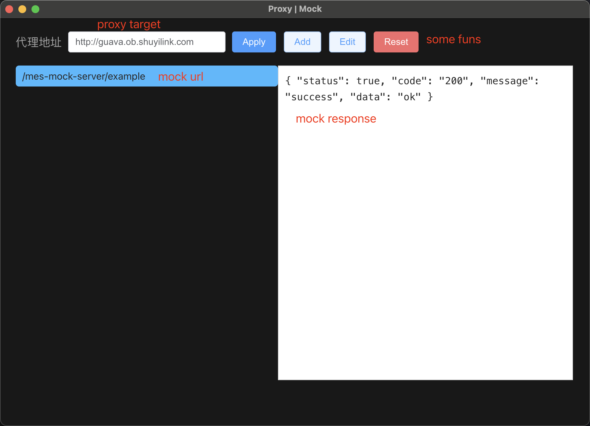

# mock-server

**Clone and run for a quick way to port docking.**

This is a minimal Electron application for resolve the request is invalid !!!

## How To Use

 - make some settings in our vue project
 ```javascript
  // .env.development
  VUE_APP_BASE_API = 'http://localhost:3000/api'
 ```

- clone and run electron application
```bash
  # Clone this repository
  git clone https://github.com/Chen0217/mock-server.git
  # Go into the repository
  cd mock-server
  # Install dependencies
  npm install
  # Run the app
  npm run start
```

- then you will see this following window 


#### 功能介绍
* 代理地址顾名思义，编辑之后点击Apply即生效
* Reset 会将你所添加的mock接口全部清空
* Add/Edit 中输入需要代理的url和response `response必须为合法的JSON字符串`

```javascript
// 如图有一个默认的mock接口: /mes-mock-server/example
// 在DFS中使用办法
export function testApi(data) {
  return request({
    url: `/mock/mes-mock-server/example`,
    method: 'POST',
    data
  })
}
// 你将得到如下返回
{
    "status": true,
    "code": "200",
    "message": "success",
    "data": "ok"
}
```