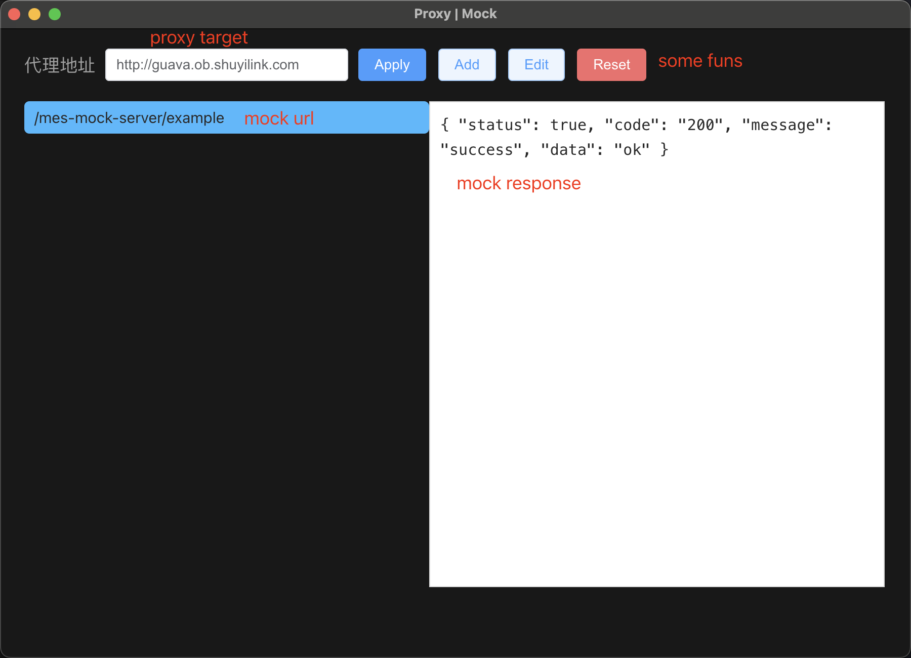

# mock-server

**Clone and run for a quick way to port docking.**

This is a minimal Electron application for resolve the request is invalid !!!

## How To Use

 - make some settings in our vue project
 ```javascript
  // .env.development
  VUE_APP_BASE_API = 'http://localhost:3000/api'
 ```

- clone and run electron application
```bash
  # Clone this repository
  git clone https://github.com/Chen0217/mock-server.git
  # Go into the repository
  cd mock-server
  # Install dependencies
  npm install
  # Run the app
  npm run start
```

- then you will see this following window 


- when request is invalid, eg.`/mes-manufacture-report/IPC/V2/scanLotCode`; Add url `/mock/mes-manufacture-report/IPC/V2/scanLotCode` and response`{ "code": 200, ...}`[must be JSON]
```javascript
// request
export function manufactureReportScanLotCode(data) {
  return request({
    url: `/mock/mes-manufacture-report/IPC/V2/scanLotCode`,
    method: 'POST',
    data
  })
}
// response
{
    "code": 200,
    ...
}
```

## Function introduction
* The proxy address connects directly to the specified destination
* Reset will reset all the mock url
* Add/Edit must be input url and response `response must be legitimate JSON string`
